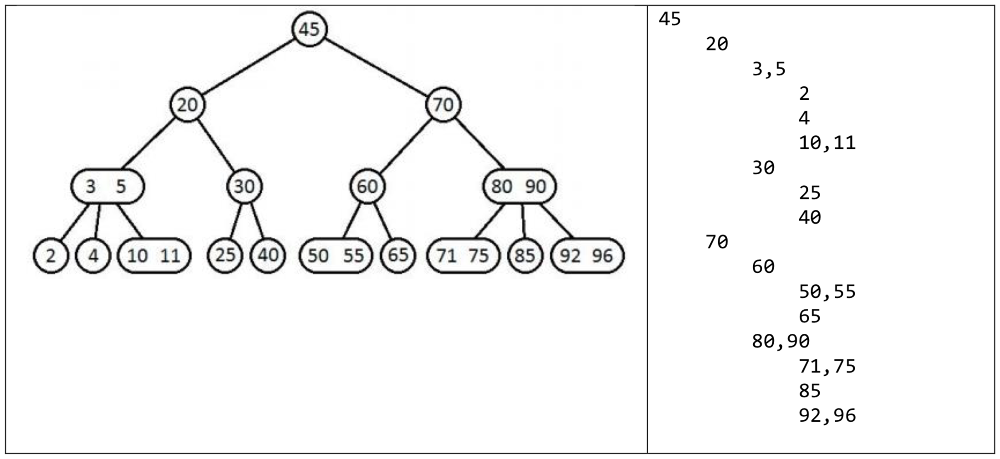
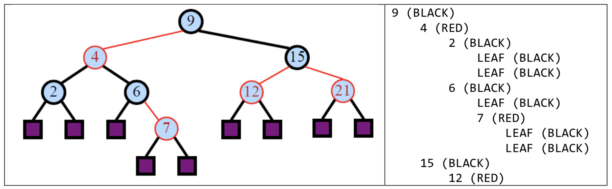

# SEARCH TREES
-------------
   
### Language : C++   
### Every input/output uses standard I/O.   
   
### Problem 1   
### Implementation of 2-4 Tree   
The program gets following commands.   
   
**INSERT key**   
Add the key into 2-4 tree. If that key already exists, print __"key ALREADY EXISTS"__.
   
**DELETE key**   
Remove the key from 2-4 tree. If the key does not exist, print __"key Not FOUND""__.
   
**SHOWTREE**   
Print out(standard I/O) whole structure of the tree. Print __NO KEYS__ if the tree is empty.   

   
**QUIT**   
Terminate the program.   
   
**Conditions**   
1. When spliting 5-node, divide into 3-node and 2-node.
2. When operating deletion, use inorder successor.
3. If underflow occurs during deletion, use left sibling.(Use right sibling if there is no left sibling in that node)
   
**EXAMPLE**   
Input   
<pre>
SHOWTREE   
INSERT 4   
INSERT 6   
INSERT 12   
INSERT 15   
INSERT 4   
INSERT 3   
INSERT 5   
INSERT 10   
INSERT 8   
SHOWTREE   
INSERT 11   
INSERT 13   
INSERT 14   
INSERT 17   
DELETE 3   
DELETE 4   
DELETE 12   
DELETE 13   
DELETE 14   
DELETE 14   
SHOWTREE   
QUIT   
</pre>   

Output   
<pre>
NO KEYS   
4 ALREADY EXISTS   
5,12   
    3,4   
    6,8,10   
    15   
14 NOT FOUND   
6,11   
    5   
    8,10   
    15,17   
</pre>   
   
## Problem 2   
## Implementation of red-black tree   
The program provides same functions with __Problem 1__ but using red-black tree.
However, when it gets SHOWTREE command, the color of each node is printed with its key as the following.   
   
   
**EXAMPLE**   
Input   
<pre>
SHOWTREE   
INSERT 4   
INSERT 7   
INSERT 12   
INSERT 15   
INSERT 3   
INSERT 5   
INSERT 14   
INSERT 18   
INSERT 16   
INSERT 17   
INSERT 5   
SHOWTREE   
DELETE 3   
DELETE 12   
DELETE 17   
DELETE 18   
DELETE 15   
DELETE 16   
DELETE 2   
SHOWTREE   
QUIT   
</pre>   

Output   
<pre>
NO KEYS   
5 ALREADY EXISTS   
14 (BLACK)   
    7 (RED)   
        4 (BLACK)   
	    3 (RED)   
		LEAF (BLACK)   
		LEAF (BLACK)   
	    5 (RED)   
		LEAF (BLACK)   
		LEAF (BLACK)   
	12 (BLACK)   
	    LEAF (BLACK)   
	    LEAF (BLACK)   
    16 (RED)   
	15 (BLACK)   
	    LEAF (BLACK)   
	    LEAF (BLACK)   
	18 (BLACK)   
	    17 (RED)   
		LEAF (BLACK)   
		LEAF (BLACK)   
	    LEAF (BLACK)   
2 NOT FOUND   
5 (BLACK)   
	4 (BLACK)   
	    LEAF (BLACK)   
	    LEAF (BLACK)   
	14 (BLACK)   
	    7 (RED)   
		LEAF (BLACK)   
		LEAF (BLACK)   
	    LEAF (BLACK)   
</pre>   
